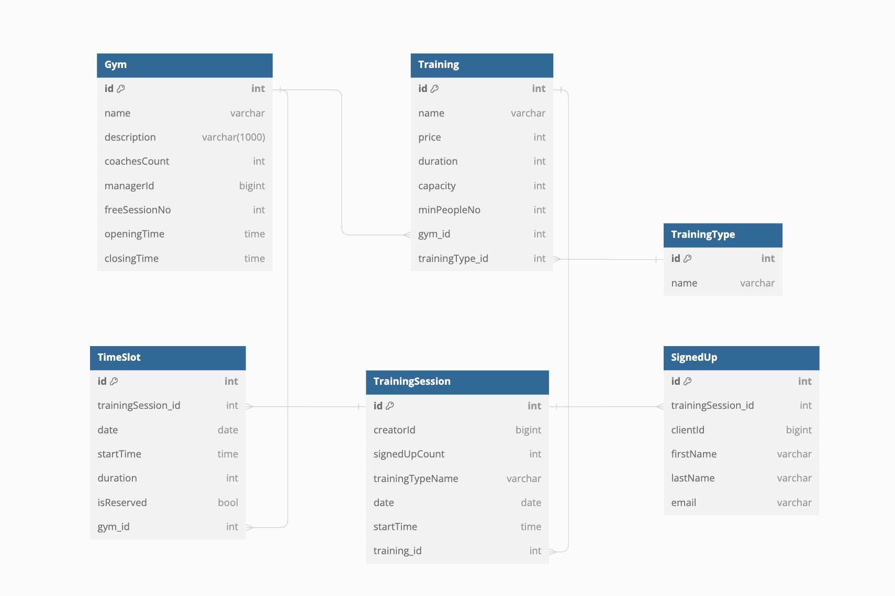

# Fitness Centre Microservices Project

This project, developed for a University subject "Software Components," aims to create a microservices application for a fitness centre. The application architecture encompasses a frontend implemented in Vue.js, an API Gateway using Zuul, a service registry powered - Eureka, and three  microservices developed with Java Spring:  

1. **User Service**
2. **Training Reservation Service**
3. **Notification Service**

## Running Locally

To run the application locally:

1. **Frontend**: From the [frontend](frontend) folder, run `npm run serve`.
2. **Backend** start the:
    1. [Eureka - service registry](Eureka/src/main/java/app/EurekaApplication.java)
    2. [Zuul - api gateway](Zuul/src/main/java/app/ZuulApplication.java)
    3. [MessageBroker](notif_servis/src/main/java/raf/fitness/notif_servis/MessageBroker.java).
    4. [User service](user_servis/src/main/java/raf/fitness/user_servis/UserServisApplication.java).
    5. [Reservation service](reservation_servis/src/main/java/raf/fitness/reservation_servis/ReservationServisApplication.java).
    6. [Notification service](notif_servis/src/main/java/raf/fitness/notif_servis/NotifServisApplication.java).

Access databases and the Swagger UI for testing purposes using the following links:

**User Service**

| Name                     | Access link                                                                            |
|--------------------------|----------------------------------------------------------------------------------------|
| Database                 | [http://localhost:8081/h2-console](http://localhost:8081/h2-console)                   |
| JDBC Driver              | jdbc:h2:mem:user-service-db                                                            |
| Swagger UI for API calls | [http://localhost:8081/swagger-ui.html#/](http://localhost:8081/swagger-ui.html#/)     |

**Reservation Service**
| Name                     | Access link                                                                       |
|--------------------------|-----------------------------------------------------------------------------------|
| Database                 | [http://localhost:8082/h2-console](http://localhost:8082/h2-console)              |
| JDBC Driver              | jdbc:h2:mem:reservation-service-db                                                |
| Swagger UI for API calls | [http://localhost:8082/swagger-ui.html#/](http://localhost:8082/swagger-ui.html#/)|

**Notification Service**

| Name                     | Access link                                                                           |
|--------------------------|---------------------------------------------------------------------------------------|
| Database                 | [http://localhost:8083/h2-console](http://localhost:8083/h2-console)                  |
| JDBC Driver              | jdbc:h2:mem:notif-service-db                                                          |
| Swagger UI for API calls | [http://localhost:8083/swagger-ui.html#/](http://localhost:8083/swagger-ui.html#/)    |

## Database schemas
Each service has it's own database. 

**User Service**

**Reservation Service**

**Notification Service**
